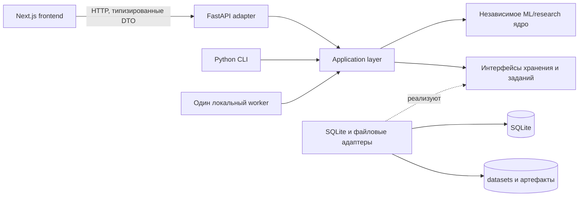

# Архитектура BeanFeature Lab

Статус: архитектурный проект до реализации; утверждённые решения по UI, основной матрице, метрикам и локальному worker зафиксированы ниже. Источники продуктовых ограничений — [`PRODUCT.md`](../../PRODUCT.md) и [научный доклад](../research/Влияние_количества_признаков_семян_фасоли_на_точность_их_классификации.docx). Экспериментальные значения, лучшая модель и минимальный `k` неизвестны. Дерево ниже описывает будущие модули; перечисленные production-файлы не созданы.

## Границы системы



- **Research** принимает данные и явные конфигурации, строит экспериментальные процедуры, возвращает типизированные результаты. Он не импортирует FastAPI, SQLite, Next.js и HTTP-схемы.
- **Application** задаёт команды `create/run/cancel/resume experiment`, запросы результатов и правила жизненного цикла; вызывает research и абстрактные порты хранения. Он не вычисляет научные метрики самостоятельно.
- **Infrastructure** реализует порты SQLite и файловой системы. Тяжёлые модели, fold-predictions и другие большие объекты остаются файлами, а SQLite хранит метаданные, конфигурации, статусы и числовые результаты.
- **FastAPI** валидирует запрос, переводит его в application-команду и возвращает DTO. Долгое обучение не выполняется в процессе обработки HTTP-запроса.
- **CLI и worker** используют те же application-команды, что и API. Experiment runner запускается без браузера и без работающего FastAPI.
- **Frontend** отображает сохранённые результаты и состояния `not run` / `not calculated`; не пересчитывает macro-F1, интервалы, stability или другие научные показатели. Plotly получает подготовленные сервером серии с их семантикой и единицами.

Первая версия использует **один локальный worker** с последовательным или явно ограниченным выполнением тяжёлых experiment jobs. Очередь и статус run сохраняются устойчиво через application/infrastructure; отмена и ошибка фиксируются как переходы состояния. Worker проверяет отмену между безопасными этапами, например между folds, и завершает активный процесс контролируемо. FastAPI только ставит задание и читает статус — nested CV не выполняется внутри HTTP request. Redis, Celery и иная распределённая инфраструктура в первую версию не входят. Порт исполнения заданий позволяет позднее заменить локальный backend без изменения ML/research ядра.

## Предлагаемое дерево репозитория

```text
BeanFeatureLab/
├── PRODUCT.md
├── apps/
│   ├── web/                         # Next.js, TypeScript, Node.js 24 LTS
│   │   ├── src/app/                 # маршруты страниц
│   │   ├── src/features/            # сценарии страниц и запросы к API
│   │   ├── src/components/          # композиция готовых UI-компонентов
│   │   ├── src/lib/api/             # типизированный HTTP-клиент и DTO
│   │   └── src/lib/plots/           # адаптация готовых серий к Plotly
│   ├── api/                         # FastAPI, Python 3.11
│   │   └── src/beanfeature_api/
│   │       ├── main.py              # сборка приложения и DI
│   │       ├── routers/             # тонкие HTTP-адаптеры по доменам
│   │       └── schemas/             # внешние request/response DTO
│   └── worker/                      # один локальный исполнитель долгих runs
├── packages/
│   ├── research/                    # научное ядро, без API/UI/SQLite
│   │   └── src/beanfeature_research/
│   │       ├── datasets/            # схема, загрузка и научная валидация
│   │       ├── splits/              # outer/inner CV и split manifests
│   │       ├── preprocessing/       # fold-local pipeline builders
│   │       ├── selection/           # фильтры, RFE, embedded, PCA
│   │       ├── models/              # фабрики классификаторов и search spaces
│   │       ├── evaluation/          # predictions, метрики, агрегация
│   │       ├── stability/           # частоты выбора и Jaccard
│   │       └── resources/           # измерение wall time, RSS, размера
│   ├── application/
│   │   └── src/beanfeature_application/
│   │       ├── commands/            # запуск, отмена, регистрация модели
│   │       ├── queries/             # чтение сохранённых сравнений
│   │       ├── ports/               # интерфейсы repo/artifact/job
│   │       └── policies/            # статусы, идентичность, права операций
│   └── infrastructure/
│       └── src/beanfeature_infrastructure/
│           ├── sqlite/              # репозитории и миграции
│           ├── files/               # manifests, datasets, model artifacts
│           └── jobs/                # сменяемый адаптер локального worker
├── tools/cli/                      # воспроизводимые команды поверх application
├── configs/experiments/            # версионируемые шаблоны протокола
├── data/
│   ├── raw/                        # неизменяемые копии источников и hashes
│   └── processed/                  # проверенные версии данных и manifests
├── storage/sqlite/                 # будущая локальная metadata/results DB
├── artifacts/
│   ├── runs/                       # snapshots, predictions, logs по run ID
│   └── models/                     # доверенные обученные модели
├── tests/
│   ├── research/                   # leakage, CV, метрики, устойчивость
│   ├── application/                # lifecycle и идемпотентность
│   ├── api/                        # HTTP-контракты
│   ├── cli/                        # запуск без UI
│   └── web/                        # доступность и сценарии страниц
└── docs/
    ├── architecture/ARCHITECTURE.md
    └── research/
        ├── EXPERIMENT_PROTOCOL.md
        └── Влияние_количества_признаков_семян_фасоли_на_точность_их_классификации.docx
```

`data/processed` допускает только воспроизводимые проверки схемы, типов и преобразования, не обучаемые на распределении всей выборки. Масштабирование, импутация при необходимости, feature selection, PCA и любая статистика, зависящая от данных, создаются внутри CV pipeline. Политика версионирования/игнорирования больших файлов определяется до первого импорта данных; в этой фазе датасет не загружается.

## Запуск, идентичность и хранение

**Experiment definition** — неизменяемый снимок протокола: версия схемы, dataset version, модель/матрица условий, сетки настройки, CV, seed, метрики и ресурсный режим. **Run** — конкретное исполнение этого снимка. Пользовательский `RUN-{sequence:06d}` выдаётся атомарным счётчиком SQLite; он не является hash и никогда не переиспользуется. Отдельный SHA-256 fingerprint от канонизированной конфигурации, dataset hash, Git state и версий ПО позволяет находить повторные исполнения. Повтор запуска получает новый run ID и тот же fingerprint при неизменном окружении.

Для официально воспроизводимого запуска требуется Git commit. Исследовательский запуск при незакоммиченном состоянии допускается только с явной пометкой `dirty`, hash снимка изменений и неизменяемой копией конфигурации; пустой Git SHA нельзя подменять вымышленным. Timestamp хранится в UTC. Все артефакты получают относительный путь внутри проекта, размер и SHA-256; API не принимает произвольные пути к файлам и не загружает присланные пользователем сериализованные модели.

Предлагаемые сущности SQLite (это описание, **не** созданная схема БД):

| Сущность | Ответственность и ключевые поля |
|---|---|
| `dataset_versions` | Источник `UCI Machine Learning Repository — Dry Bean Dataset — Dataset ID 602`, версия/дата получения, raw и processed hashes, схема 16 признаков, путь к manifest. |
| `experiment_definitions` | ID, версия конфигурации, canonical JSON, hash, создано/утверждено. |
| `experiment_runs` | `run_id`, definition ID, UTC timestamps, status, Git SHA/dirty state, seed, dataset version/hash, environment snapshot, ошибка последнего шага. |
| `run_conditions` | Модель, selector, search space, `budget_kind`, запрошенное `k`, число исходных входных измерений, стадия матрицы. |
| `cv_splits` | Повтор/fold, seeds, hash и путь к индексам train/test, число объектов и классов. |
| `fold_results` | Condition и outer fold, лучшие inner-параметры, выбранные **исходные** признаки или PCA metadata, fold-level метрики, fit/inference time, peak RSS, путь к prediction/model artifacts, статус. |
| `aggregate_results` | Группировка по condition, метрики и неопределённость с версией метода агрегации, ресурсные сводки; публикуется только после завершения требуемых folds. |
| `run_events` | Переходы статуса, ошибки с этапом и временем, предупреждения, попытки возобновления. |
| `model_registry` | Позднее: ссылка на проверенный artifact, schema входа, provenance и статус допуска к classifier demo. |

Для `run_conditions` нужен явный `budget_kind`: `original_features` или `pca_components`. При **фиксированном** бюджете `original_features` запрошенное `k` — точное число исходных колонок. При `pca_components` запрошенное `k` — число компонент; `required_raw_feature_count` обычно остаётся 16 и никогда не выводится из числа компонент. Для L1-path с переменной разреженностью запрошенное `k` равно `null`, а `observed_nonzero_count` сохраняется по каждому fold; его нельзя выдавать за заранее заданное `k`. Выбранные признаки в PCA-ветви — `null`, а не вымышленный список физических измерений.

Run проходит состояния `queued → running → completed`, либо `cancelling → cancelled` или `failed`. Статус сохраняется до ответа API; после сбоя локальный worker сверяет незавершённые задания и не выдаёт их за успешные. Неудачный или частичный run сохраняет уже полученные fold records и ошибку, но не публикует итоговые метрики как завершённые. Неполученные значения — `null` с явным состоянием `not_calculated`; ноль означает реально измеренный ноль. Worker пишет артефакт во временный файл, проверяет hash, затем атомарно перемещает и фиксирует metadata; краткие SQLite-транзакции и один writer-путь предотвращают длительную блокировку БД.

## API boundaries

Группы будущих `/api/v1` endpoint'ов и их роль; URL ниже — контрактное предложение, не реализованные маршруты.

| Группа | Возможные операции | Источник ответа |
|---|---|---|
| `datasets` | список версий, manifest, валидация доступного файла | SQLite metadata и файловый manifest; не передавать весь датасет по умолчанию |
| `experiments` | шаблоны/definitions, просмотр конфигурации | SQLite, immutable config snapshot |
| `runs` | создать, статус, отменить, folds, результаты, ошибки | application service и сохранённые данные |
| `models` | зарегистрированные проверенные artifacts, schema входа | registry и файловый manifest |
| `features` | budgets, selection frequency, stability, PCA variance | заранее рассчитанные scientific aggregates |
| `comparisons` | сравнение условий/моделей по общим folds | сохранённые агрегаты и дешёвый join/filter |
| `predictions` | табличное предсказание проверенной модели | отдельный inference use case; не эксперимент |
| `system/reproducibility` | Git/data/software provenance, состояние worker | сохранённый environment snapshot и статус |

Сервер заранее вычисляет и сохраняет fold-level метрики, confidence/uncertainty по утверждённой методике, confusion matrices, selection frequency/Jaccard и resource summaries. Запрос может дешёво фильтровать, сортировать, пагинировать, соединять записи и превращать сохранённые сводки в серии для Plotly; при смене **научной** формулы создаётся версия расчёта, а не скрытый пересчёт в браузере. Большие predictions и модели выдаются через управляемые ссылки/экспорт, а не в каждой выдаче списка. Для ошибок API различает `not_run`, `running`, `failed`, `not_calculated` и `completed`.

## Поддерживаемые страницы без визуального проектирования

Текущие маршруты приложения могут опираться на одни и те же API-сущности: Overview — состояние и реальные сводки; Experiments — definitions; Experiment Runner — запуск и прогресс; Feature Budget — серии по `k` и его типу; Feature Explorer — частоты и stability; Model/experiment comparison — парные сравнения; Classifier Demo — инференс только через зарегистрированную модель. При отсутствии результатов каждая страница показывает `not run`/`not calculated`, а не случайные данные.

Поздние Experiment Registry, Pareto Analysis, Conference Mode, расширенные сравнения, ручная ablation и генерация отчёта добавляются как новые application queries/commands и UI-маршруты поверх сохранённых fold results и artifacts. Они не требуют переноса ML-логики в API или frontend. Ручная ablation создаёт новую версионируемую experiment definition и честный run, а не изменяет сохранённые научные результаты.

## Утверждённый React UI stack

Утверждены **MUI Core, MUI X Data Grid Community, Tabler Icons и Plotly**. Lucide, MUI X Pro/Premium, коммерческие возможности Data Grid и MUI Charts не входят в первую версию. Plotly используется для научных графиков. Собственный UI kit не создаётся: стандартные buttons, inputs, forms, dialogs, tabs, menus, tooltips, navigation, tables/data grids, pagination, alerts и progress/state indicators собираются из готовых MUI-компонентов там, где они подходят. Custom components допустимы только для специфических исследовательских представлений BeanFeature Lab, которые нельзя разумно собрать из готовых primitives.

Табличные сценарии проектируются в пределах лицензии Community: базовая сортировка и фильтрация по одному критерию, пагинация с ограничением размера страницы до 100 строк. Multi-sort, multi-filter, column pinning, row grouping и Excel export не предполагаются как возможности Data Grid первой версии. При потребности в иных сценариях сначала проверяется состав актуальной Community-версии и отдельно принимается продуктовое решение; скрытой зависимости от Pro/Premium быть не должно.

Сравнение, на основании которого выбран стек, сохранено для объяснения решения:

| Критерий | Mantine | Material UI (MUI) |
|---|---|---|
| Готовые компоненты, формы, навигация | Широкий набор, `AppShell`, поля, навигация и `@mantine/form` с валидацией. | Широкий Core-набор; формы и навигация готовы, сложная форма требует собственной orchestration или отдельной form-библиотеки. |
| Таблицы | Core `Table` хорошо подходит для небольших семантических таблиц; полноценный data grid находится в экосистеме extensions, не в Core. | Официальный `MUI X Data Grid` даёт сортировку, фильтрацию, пагинацию, виртуализацию и keyboard navigation. Community бесплатен; часть продвинутых функций платная. |
| Accessibility | Документация заявляет WAI-ARIA, keyboard/focus и тесты; доступность итогового приложения всё равно проверяется отдельно. | Data Grid документирует WAI-ARIA и навигацию с клавиатуры; кастомные ячейки и Plotly требуют отдельного аудита. |
| Responsive и theming | Готовый responsive `AppShell`, provider и Styles API; удобно уйти от шаблонного dashboard. | Breakpoints, theme/component overrides и CSS variables; исходный Material-облик потребует последовательной настройки позже. |
| Next.js | Официальная инструкция App Router; компоненты используют client boundary. | Официальная интеграция App Router с cache provider для SSR/streaming. |
| Объём собственного UI-кода | Меньше для форм и shell; больше интеграционной работы, если нужен сложный grid из extension. | Меньше для реестров и таблиц благодаря Data Grid; тема и композиция потребуют работы, но базовые элементы не переписываются. |
| Иконки и поддерживаемость | Совместим с `@tabler/icons-react`; Core и grid-extension обновляются отдельно. | Совместим с `@tabler/icons-react`; Core и X имеют официальную поддержку, но план функций X надо проверять до использования. |

**Причина утверждённого выбора:** реестры запусков и сравнения требуют готового доступного data grid с минимальным собственным кодом. При будущем проектировании не брать типовой AI/SaaS dashboard template: структура должна исходить из научных задач и происхождения данных. Выбор библиотеки не задаёт палитру, типографику и визуальную композицию; они относятся к отдельному этапу. Если возникнет потребность в функциях Pro/Premium, требуется отдельное будущее решение; первая версия на них не опирается. При build закрепить совместимые версии и провести проверку доступности реальных страниц и Plotly.

Основание сравнения: официальные документы [Mantine Next.js](https://mantine.dev/guides/next/), [Mantine AppShell](https://mantine.dev/core/app-shell/), [Mantine Table](https://mantine.dev/core/table/), [Mantine Forms](https://mantine.dev/form/validation/), [Mantine accessibility](https://help.mantine.dev/q/are-mantine-components-accessible), [MUI Next.js](https://mui.com/material-ui/integrations/nextjs/), [MUI Data Grid](https://mui.com/x/react-data-grid/), [MUI X licensing](https://mui.com/x/introduction/licensing/), [Data Grid filtering](https://mui.com/x/react-data-grid/filtering/), [Data Grid sorting](https://mui.com/x/react-data-grid/sorting/), [Data Grid pagination](https://mui.com/x/react-data-grid/pagination/), [MUI Data Grid accessibility](https://mui.com/x/react-data-grid/accessibility/), [Tabler React icons](https://tabler.io/icons/packages). Сведения о возможностях библиотек проверены на этапе проектирования; совместимость конкретных версий следует повторно проверить перед установкой.

## Решения перед build

Для перехода к **визуальному концепту** блокирующих продуктовых или UI-stack решений нет; облик интерфейса формируется на отдельном этапе. Перед научным build остаётся определить метод интервала для зависимых repeated-CV оценок, search budget и контрольные точки `k` в конфигурации, условия resource benchmark и необходимость независимой подтверждающей выборки. Способ развёртывания и политика доступа к локальным данным/артефактам решаются до production-развёртывания. Утверждённый margin macro-F1 `0.01`, Core-модели и обязательные метрики не являются открытыми решениями.
